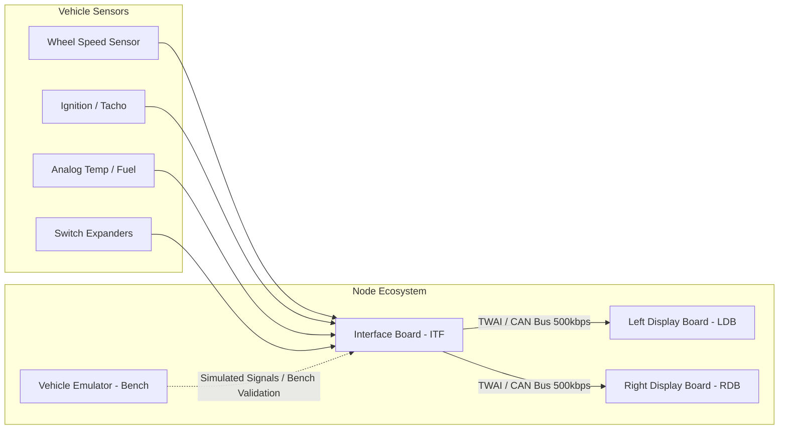

# VX Binocle — Automotive Digital Instrument Cluster Firmware

[](https://github.com/martinroger/vx-binocle-espidf/actions/workflows/release.yml)

## 📖 Project Overview

**VX Binocle** is an open-source, multi-node embedded firmware ecosystem designed to replace the analog instrument cluster in classic sports cars (specifically Opel Speedster / Vauxhall VX220) with modern dual digital displays, real-time sensor ingestion, and CAN bus telemetry.



---

## 🗂️ Repository & Sub-Project Structure

| Directory | Target Hardware | Purpose & Core Capabilities |
| :--- | :--- | :--- |
| **[`interface_board`](interface_board)** | ESP32-S3 | Sensor acquisition node (pulse capture, ADS1115 ADC, TCA9555 expander, TWAI broadcaster). |
| **[`left_screen`](left_screen)** | ESP32-S3 | Primary cluster display (LVGL v9, RPM arc, speed readout, overtemperature buzzer alarm). |
| **[`right_screen`](right_screen)** | ESP32-S3 | Secondary cluster display (LVGL v9, fuel/battery/oil gauges, trip statistics). |
| **[`factory apps/ITF factory app`](factory%20apps/ITF%20factory%20app)** | ESP32-S3 | ITF captive Wi-Fi AP, NVS calibration, sensor zeroing, and safe reboot sequencing. |
| **[`factory apps/left display factory app`](factory%20apps/left%20display%20factory%20app)** | ESP32-S3 | LDB display diagnostics, test pattern generation, and web-based OTA flashing. |
| **[`factory apps/right display factory app`](factory%20apps/right%20display%20factory%20app)** | ESP32-S3 | RDB display diagnostics, test pattern generation, and web-based OTA flashing. |
| **[`bennu`](bennu)** | ESP32-S3 | Special delivery recovery payload for remote factory app & SPIFFS overwrite via OTA. |
| **[`emulator-console`](emulator-console)** | ESP32-S3 | Vehicle simulator with serial console, ESPHome firmware, and Node-RED drivecycle replayer. |
| **[`common/binocan`](common/binocan)** | Shared | DBC CAN database (`binocan.dbc`) and generated C encode/decode libraries. |
| **[`common/lvgl_v9_port`](common/lvgl_v9_port)** | Shared | High-performance double-buffered LVGL v9 ESP32-S3 display driver port. |
| **[`common/twai_daemon`](common/twai_daemon)** | Shared | Non-blocking TWAI/CAN background ingestion daemon. |
| **[`docs`](docs)** | Documentation | System requirements, operational constraints, and sequence diagrams. |

---

## 📦 Global External Dependency Matrix

The table below summarizes external component dependencies managed via `idf_component.yml` and locked in `dependencies.lock`:

| Sub-Project | External Dependency | Locally Installed Version | Version Requirement |
| :--- | :--- | :--- | :--- |
| `emulator-console` | `espressif/ESP32_IO_Expander` | `1.1.1` | `*` |
| `emulator-console` | `espressif/esp-lib-utils` | `0.2.3` | `0.2.*` *(transitive)* |
| `interface_board` | `esp-idf-lib/ads111x` | `1.1.14` | `^1.1.12` |
| `interface_board` | `esp-idf-lib/tca95x5` | `1.0.7` | `^1.0.7` |
| `interface_board` | `esp-idf-lib/esp_idf_lib_helpers` | `1.4.0` | `*` *(transitive)* |
| `interface_board` | `esp-idf-lib/i2cdev` | `2.1.2` | `*` *(transitive)* |
| `left_screen` | `espressif/esp32_display_panel` | `1.0.4` | `^1.0.2` |
| `left_screen` | `lvgl/lvgl` | `9.5.0` | `^9.4.0` |
| `left_screen` | `espressif/esp-lib-utils` | `0.2.3` | `0.2.*` *(transitive)* |
| `left_screen` | `espressif/esp32_io_expander` | `1.1.1` | `1.*` *(transitive)* |
| `right_screen` | `espressif/esp32_display_panel` | `1.0.4` | `^1.0.2` |
| `right_screen` | `lvgl/lvgl` | `9.5.0` | `^9.4.0` |
| `right_screen` | `espressif/esp-lib-utils` | `0.2.3` | `0.2.*` *(transitive)* |
| `right_screen` | `espressif/esp32_io_expander` | `1.1.1` | `1.*` *(transitive)* |
| `factory apps/ITF factory app` | `espressif/mdns` | `1.11.3` | `*` |
| `factory apps/left display factory app` | `espressif/mdns` | `1.11.3` | `*` |
| `factory apps/right display factory app` | `espressif/mdns` | `1.11.3` | `*` |

---

## 📐 Architecture & Operational Documentation

For technical specifications, platform constraints, and interaction flows, refer to:
- **[System Requirements & Traceability Matrix](docs/REQUIREMENTS.md)**: Formal functional requirements and verification mapping.
- **[Operational & Architecture Constraints](docs/CONSTRAINTS.md)**: Target SoCs, ESP-IDF v5.5.x constraints, and hardware safety rules.
- **[Protocol & State Machine Scenarios](docs/SCENARIOS.md)**: Mermaid sequence diagrams for boot, stream timeouts, and fault alerts.

---

## 🛠️ Build & Compilation Guidelines

This project targets **ESP-IDF v5.5.x** on the **ESP32-S3** architecture.

```bash
# Build Interface Board
cd interface_board
idf.py set-target esp32s3
idf.py build

# Build Left Display
cd ../left_screen
idf.py set-target esp32s3
idf.py build

# Generate Bennu Special Delivery Packages (ITF_bennu.bin, LDB_bennu.bin, RDB_bennu.bin)
python tools/build_deliveries.py --app all
```

> [!TIP]
> When modifying `Kconfig`, `Kconfig.projbuild`, or `sdkconfig.defaults`, always run a full clean build (`idf.py fullclean build`).
