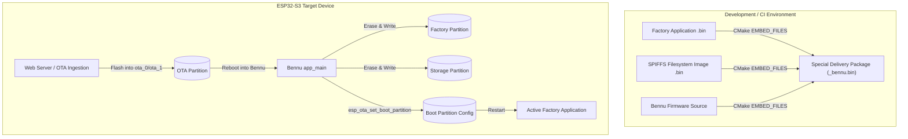
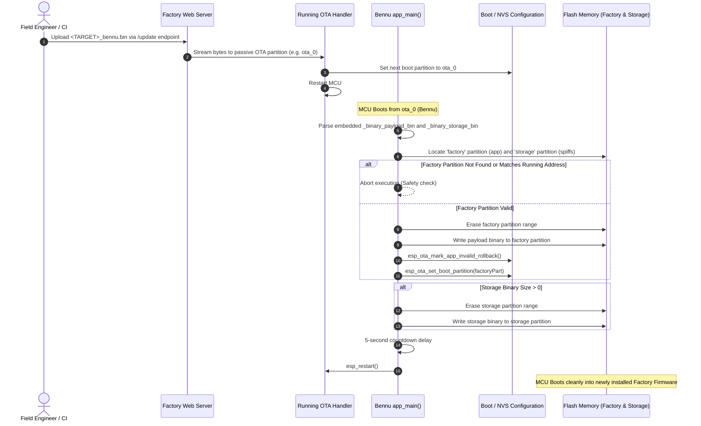

# Theory of Operation — Bennu Special Delivery Subsystem

## 1. System Architecture & Context

**Bennu** is an operational recovery and factory bootstrap mechanism. In standard operation, updating the `factory` app partition and the `storage` partition cannot be performed directly while the running application occupies that space or manages active SPIFFS mounts. 

Bennu solves this problem by packaging the target firmware image and its corresponding SPIFFS filesystem into an executable ESP32 binary payload flashed into an OTA slot.

---

## 2. Sequence Diagram: Delivery Handshake & Flash Rewrite

---

## 3. Flash Layout & Partition Targets

Bennu interacts with the following partition definitions:

| Partition Name | Type | Subtype | Function |
| :--- | :--- | :--- | :--- |
| `nvs` | `data` | `nvs` | Non-volatile settings & calibration storage |
| `otadata` | `data` | `ota` | OTA boot selection metadata |
| `factory` | `app` | `factory` | Primary target partition for payload binary |
| `ota_0` / `ota_1` | `app` | `ota_0` / `ota_1` | Transient staging partition running Bennu |
| `storage` | `data` | `spiffs` | Target filesystem partition for web & config assets |

---

## 4. Safety & Error Recovery Guarantees

1. **Self-Target Abort**: Bennu checks `esp_ota_get_running_partition()` against the destination `factory` partition address. If Bennu itself is running in the `factory` partition, it immediately halts to prevent self-erasure.
2. **Rollback Invalidation**: Immediately following the successful write to the `factory` partition, Bennu invokes `esp_ota_mark_app_invalid_rollback()`. This guarantees that if the subsequent reboot encounters an unexpected power failure, the bootloader will not attempt to boot the temporary Bennu partition again.
3. **Partition Boundary Verification**: Erase and write operations specify exact partition offsets and bounded sizes (`factoryPart->size` and `payload_bin_size`).
