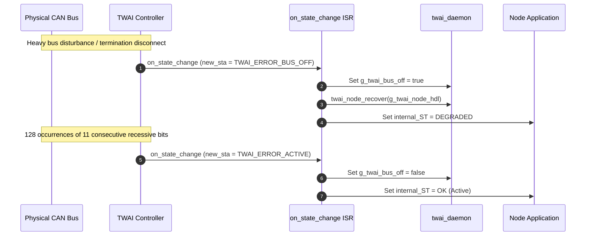

# TWAI Daemon — Theory of Operation

## 1. System Architecture

The `twai_daemon` component interfaces the ESP32-S3 on-chip TWAI peripheral to application tasks across all cluster nodes using the modernized ESP-IDF `esp_driver_twai` API:

```mermaid
graph TD
    subgraph Transmission Path (Asynchronous TX Pool)
        A[Packaging Task] -->|twai_transmit_msg| B(Acquire Persistent Slot)
        B -->|Copy 8-byte payload| C[(s_tx_slots Pool - 32 slots)]
        C -->|twai_node_transmit| D[Driver tx_mount_queue]
        D -->|Hardware Free| E[CAN Physical Bus]
        E -->|on_tx_done ISR| F[Release Slot back to Pool]
        F --> C
    end

    subgraph Reception Path (Event-Driven)
        E -->|Hardware RX FIFO| G(on_rx_done ISR)
        G -->|twai_node_receive_from_isr| H(xQueueSendFromISR)
        H --> I[(g_twai_rx_queue - Depth 32)]
        I -->|xQueueReceive| J[CAN_RX_Task Worker]
        J -->|dispatchFrame| K[Declarative Route Table]
        K -->|Reset Timer & Decode| L[Message Handler]
    end

    subgraph Fault Recovery
        E -->|Bus Error / Bus-Off| M(on_state_change ISR)
        M -->|TWAI_ERROR_BUS_OFF| N[twai_node_recover]
        N -->|TWAI_ERROR_ACTIVE| O[Reset Degraded State]
    end
```

---

## 2. Ingestion & Transmission Pipeline

### 2.1 Asynchronous TX Frame Pool Architecture
- `esp_driver_twai` operates on a zero-copy pointer-passing model (`sizeof(twai_frame_t *)`), queuing memory addresses rather than deep-copying frame descriptors.
- To prevent stack dangling pointer corruptions when transmitting asynchronously under bus congestion or multi-task arbitration, `twai_daemon` manages a 32-slot static descriptor pool (`s_tx_slots` + `s_tx_pool_queue`).
- **Transmission Flow**:
  1. `twai_transmit_msg()` or `twai_transmit_frame()` acquires a free slot from `s_tx_pool_queue`.
  2. The frame header and payload buffer (up to 8 bytes) are copied into the persistent slot memory.
  3. `twai_node_transmit()` queues the persistent slot pointer into the driver's hardware queue and returns immediately.
  4. Once physical transmission completes on the bus, the hardware interrupt invokes `on_tx_done_cb`.
  5. The ISR verifies the frame address and returns the slot back to `s_tx_pool_queue` via `xQueueSendFromISR()`.

### 2.2 Event-Driven Reception Loop
- The driver registers an `on_rx_done` callback during `initCAN()`.
- Upon frame arrival, the hardware interrupt fires, invoking `twai_node_receive_from_isr(handle, &rx_frame)`.
- The frame header and data payload are copied into a fixed-size `twai_queued_frame_t` and dispatched to `g_twai_rx_queue` via `xQueueSendFromISR()`.
- If a frame dispatcher is registered, `CAN_RX_Task` ingests frames from `g_twai_rx_queue` with a configurable timeout (`CONFIG_CAN_RX_TIMEOUT_MS`).

---

## 3. Declarative Route Table Architecture

Display boards implement a declarative table mapping incoming CAN Frame IDs to handlers and FreeRTOS timeout watchdogs:

```cpp
struct twai_route_entry_t {
    uint32_t frame_id;
    twai_frame_handler_t handler;
    uint32_t timeout_ms;
    TimerCallbackFunction_t timeout_cb;
    TimerHandle_t timer_hdl;
    const char *name;
};
```

### 3.1 Automated Lifecycle Management
1. **`TO_timers_init()`**: Loops through `rx_routes[]` and creates FreeRTOS software timers for each active route.
2. **`TO_timers_start()` / `TO_timers_stop()`**: Bulk activates or suspends route timers during state changes or OTA flashing.
3. **`dispatchFrame(rxMsg)`**: Matches `rxMsg->header.id` against the route table, automatically resets the route's watchdog timer via `xTimerReset()`, and delegates decoding to the handler.

---

## 4. Fault Tolerance & Bus-Off Recovery



- When error counters reach the bus-off limit (TEC > 255), the hardware transitions to `TWAI_ERROR_BUS_OFF`.
- `twai_state_change_cb` flags `g_twai_bus_off = true` to suppress further TX attempts, logs the fault, and triggers `twai_node_recover()`.
- Upon successful bus recovery (128 occurrences of 11 consecutive recessive bits), the driver returns to `TWAI_ERROR_ACTIVE`, clearing the fault condition without needing a system reboot.
