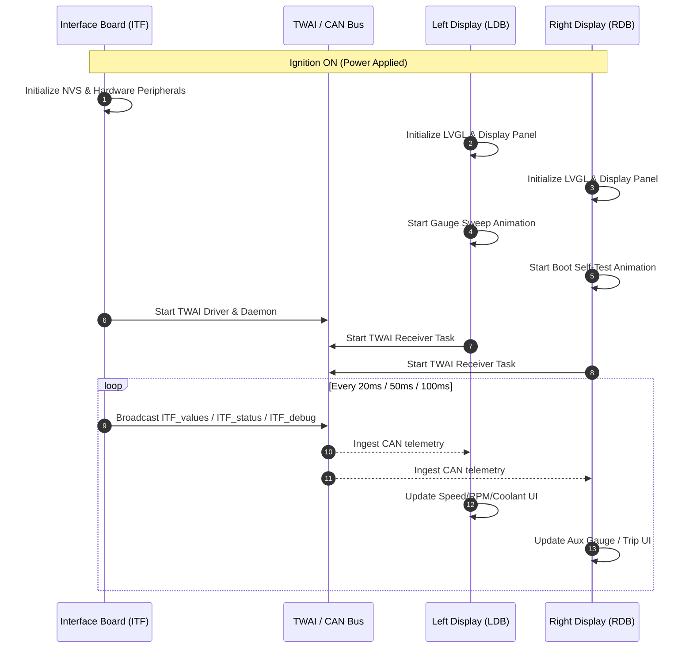
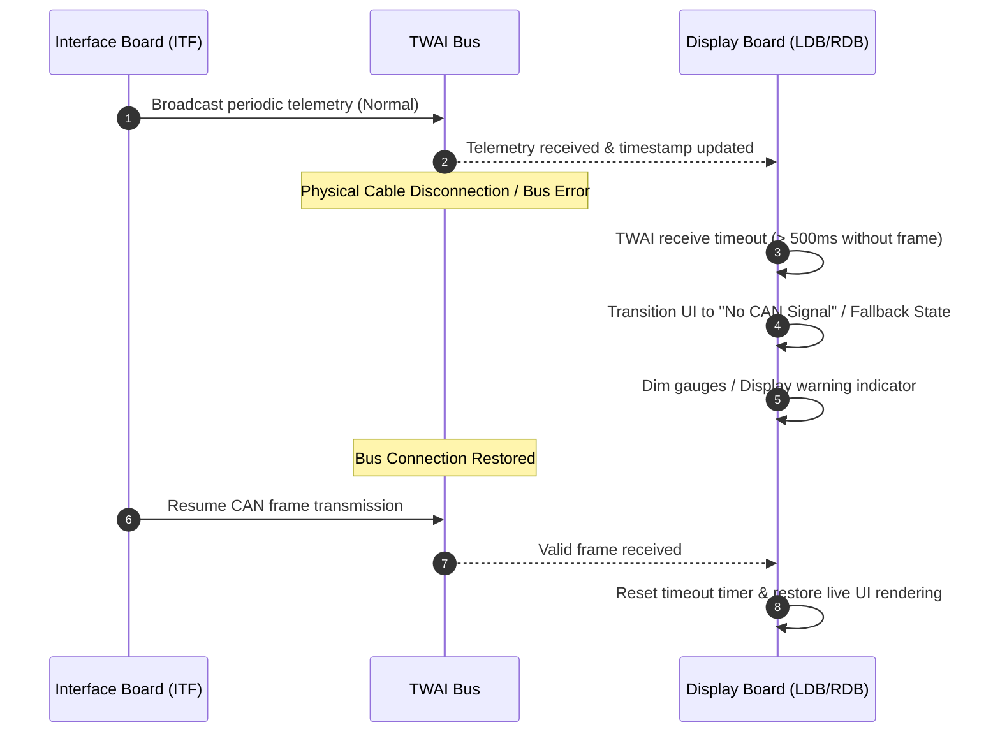
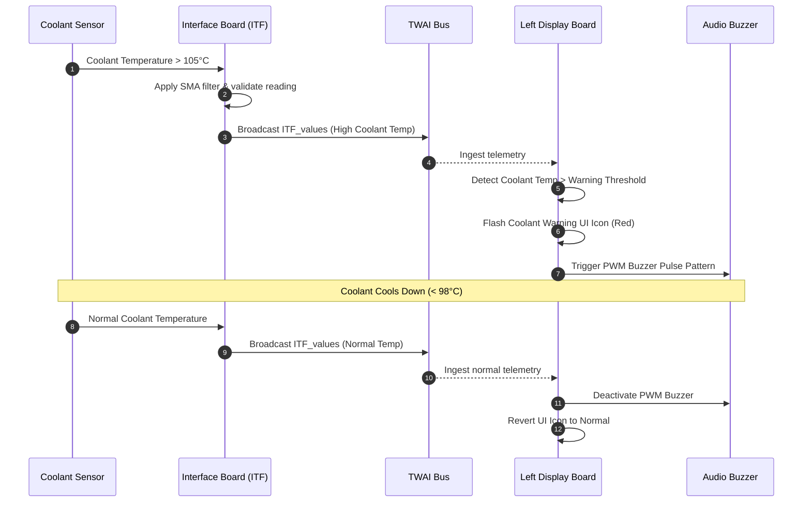
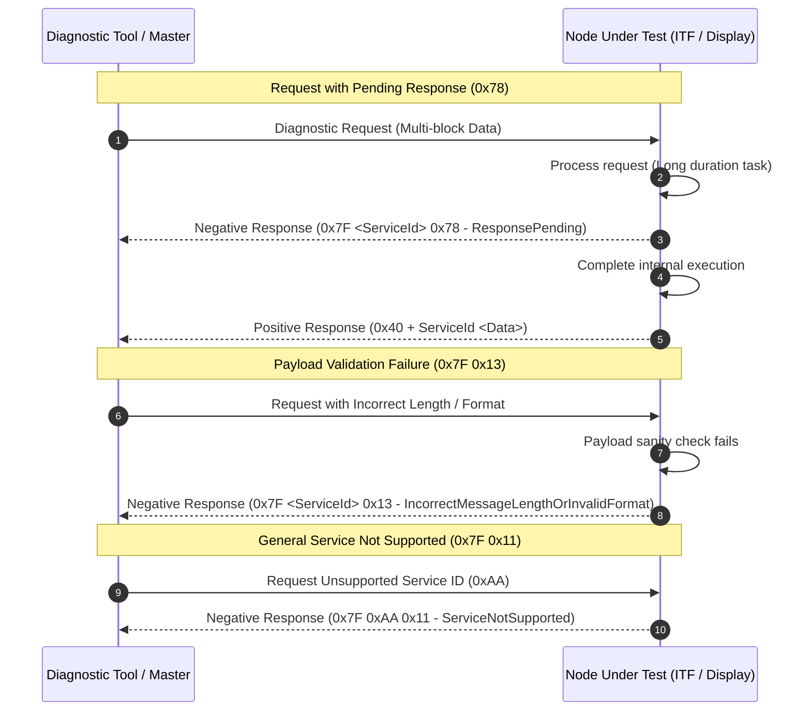
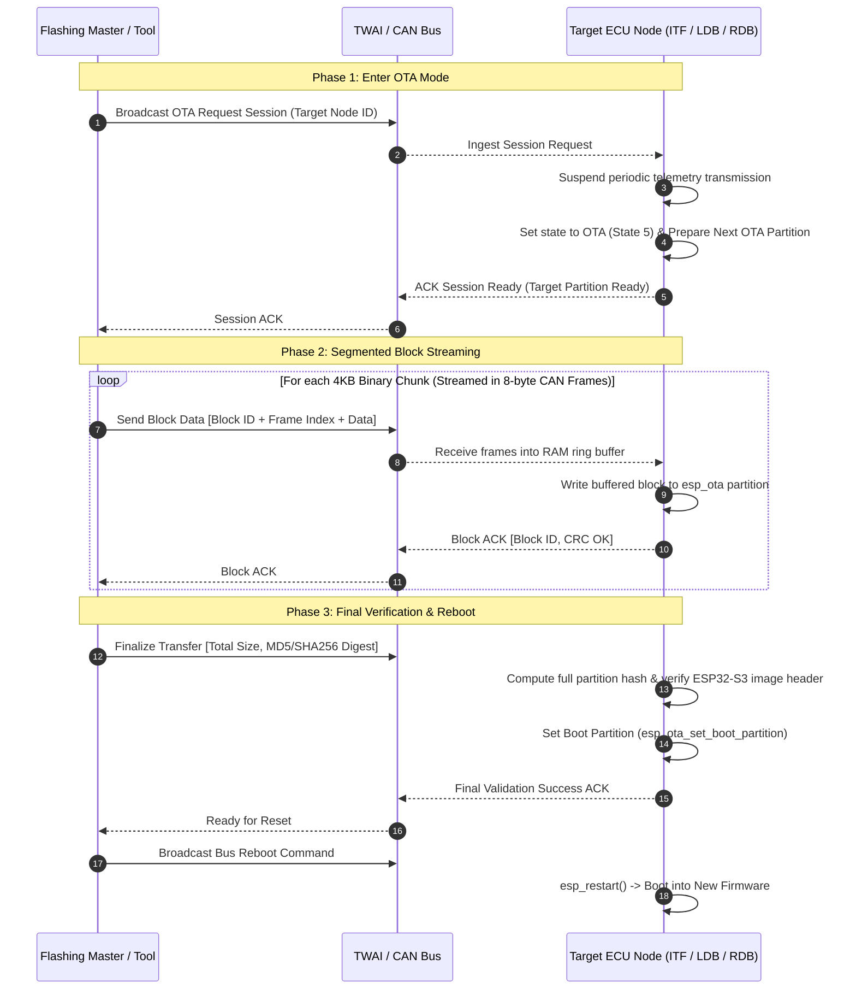

# VX Binocle Protocol & State Machine Scenarios

This document outlines key sequence flows, communication patterns, and error escape mechanisms used across the VX Binocle system.

---

## 1. System Boot & Initialization Sequence

---

## 2. CAN Stream Loss & Timeout Recovery

---

## 3. High-Priority Alert Flow: Coolant Over-Temperature

---

## 4. Diagnostic Handshake & Protocol Error Handling

---

## 5. OTA-Over-CAN Firmware Flashing Sequence

