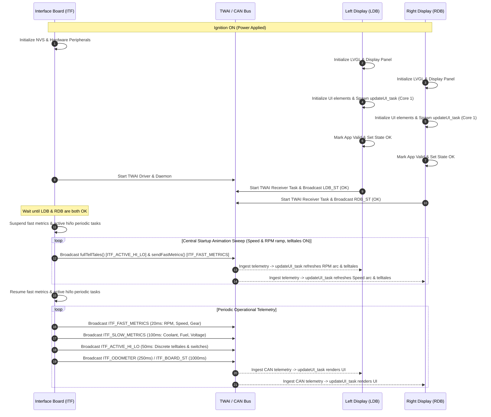
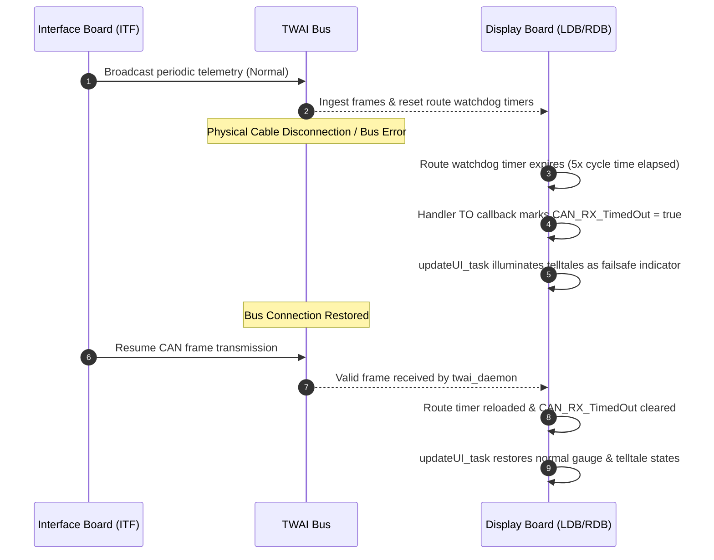
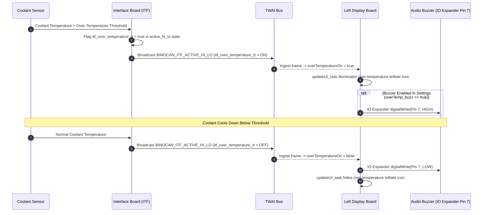
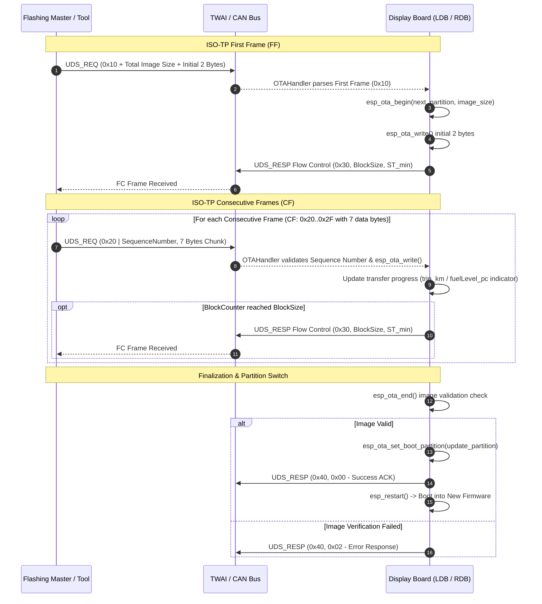

# VX Binocle Protocol & State Machine Scenarios

This document outlines key sequence flows, communication patterns, and error escape mechanisms implemented across the VX Binocle system.

---

## 1. System Boot & Initialization Sequence

```mermaid
sequenceDiagram
    autonumber
    participant ITF as Interface Board (ITF)
    participant CAN as TWAI / CAN Bus
    participant LDB as Left Display (LDB)
    participant RDB as Right Display (RDB)

    Note over ITF, RDB: Ignition ON (Power Applied)
    ITF->>ITF: Initialize NVS & Hardware Peripherals
    LDB->>LDB: Initialize LVGL & Display Panel
    RDB->>RDB: Initialize LVGL & Display Panel
    
    LDB->>LDB: Initialize UI elements & Spawn updateUI_task (Core 1)
    RDB->>RDB: Initialize UI elements & Spawn updateUI_task (Core 1)

    LDB->>LDB: Mark App Valid & Set State OK
    RDB->>RDB: Mark App Valid & Set State OK

    ITF->>CAN: Start TWAI Driver & Daemon
    LDB->>CAN: Start TWAI Receiver Task & Broadcast LDB_ST (OK)
    RDB->>CAN: Start TWAI Receiver Task & Broadcast RDB_ST (OK)

    Note over ITF: Wait until LDB & RDB are both OK
    ITF->>ITF: Suspend fast metrics & active hi/lo periodic tasks
    loop Central Startup Animation Sweep (Speed & RPM ramp, telltales ON)
        ITF->>CAN: Broadcast fullTellTales() [ITF_ACTIVE_HI_LO] & sendFastMetrics() [ITF_FAST_METRICS]
        CAN-->>LDB: Ingest telemetry -> updateUI_task refreshes RPM arc & telltales
        CAN-->>RDB: Ingest telemetry -> updateUI_task refreshes Speed arc & telltales
    end
    ITF->>ITF: Resume fast metrics & active hi/lo periodic tasks

    loop Periodic Operational Telemetry
        ITF->>CAN: Broadcast ITF_FAST_METRICS (20ms: RPM, Speed, Gear)
        ITF->>CAN: Broadcast ITF_SLOW_METRICS (100ms: Coolant, Fuel, Voltage)
        ITF->>CAN: Broadcast ITF_ACTIVE_HI_LO (50ms: Discrete telltales & switches)
        ITF->>CAN: Broadcast ITF_ODOMETER (250ms) / ITF_BOARD_ST (1000ms)
        CAN-->>LDB: Ingest CAN telemetry -> updateUI_task renders UI
        CAN-->>RDB: Ingest CAN telemetry -> updateUI_task renders UI
    end
```

---

## 2. CAN Stream Loss & Timeout Recovery

```mermaid
sequenceDiagram
    autonumber
    participant ITF as Interface Board (ITF)
    participant CAN as TWAI Bus
    participant DSP as Display Board (LDB/RDB)

    ITF->>CAN: Broadcast periodic telemetry (Normal)
    CAN-->>DSP: Ingest frames & reset route watchdog timers
    
    Note over CAN: Physical Cable Disconnection / Bus Error
    DSP->>DSP: Route watchdog timer expires (5x cycle time elapsed)
    DSP->>DSP: Handler TO callback marks CAN_RX_TimedOut = true
    DSP->>DSP: updateUI_task illuminates telltales as failsafe indicator
    
    Note over CAN: Bus Connection Restored
    ITF->>CAN: Resume CAN frame transmission
    CAN-->>DSP: Valid frame received by twai_daemon
    DSP->>DSP: Route timer reloaded & CAN_RX_TimedOut cleared
    DSP->>DSP: updateUI_task restores normal gauge & telltale states
```

---

## 3. High-Priority Alert Flow: Coolant Over-Temperature

```mermaid
sequenceDiagram
    autonumber
    participant SENS as Coolant Sensor
    participant ITF as Interface Board (ITF)
    participant CAN as TWAI Bus
    participant LDB as Left Display Board
    participant BUZZ as Audio Buzzer (IO Expander Pin 7)

    SENS->>ITF: Coolant Temperature > Over-Temperature Threshold
    ITF->>ITF: Flag itf_over_temperature_tt = true in active_hi_lo state
    ITF->>CAN: Broadcast BINOCAN_ITF_ACTIVE_HI_LO (itf_over_temperature_tt = ON)
    CAN-->>LDB: Ingest frame -> overTemperatureOn = true
    
    LDB->>LDB: updateUI_task illuminates over-temperature telltale icon
    opt Buzzer Enabled in Settings (overTemp_buzz == true)
        LDB->>BUZZ: IO Expander digitalWrite(Pin 7, HIGH)
    end
    
    Note over SENS, BUZZ: Coolant Cools Down Below Threshold
    SENS->>ITF: Normal Coolant Temperature
    ITF->>CAN: Broadcast BINOCAN_ITF_ACTIVE_HI_LO (itf_over_temperature_tt = OFF)
    CAN-->>LDB: Ingest frame -> overTemperatureOn = false
    LDB->>BUZZ: IO Expander digitalWrite(Pin 7, LOW)
    LDB->>LDB: updateUI_task hides over-temperature telltale icon
```

---

## 4. Over-The-Air (OTA) Firmware Flashing over CAN (ISO-TP Transport)

```mermaid
sequenceDiagram
    autonumber
    participant MASTER as Flashing Master / Tool
    participant CAN as TWAI / CAN Bus
    participant DSP as Display Board (LDB / RDB)

    Note over MASTER, DSP: ISO-TP First Frame (FF)
    MASTER->>CAN: UDS_REQ (0x10 + Total Image Size + Initial 2 Bytes)
    CAN-->>DSP: OTAHandler parses First Frame (0x10)
    DSP->>DSP: esp_ota_begin(next_partition, image_size)
    DSP->>DSP: esp_ota_write() initial 2 bytes
    DSP->>CAN: UDS_RESP Flow Control (0x30, BlockSize, ST_min)
    CAN-->>MASTER: FC Frame Received

    Note over MASTER, DSP: ISO-TP Consecutive Frames (CF)
    loop For each Consecutive Frame (CF: 0x20..0x2F with 7 data bytes)
        MASTER->>CAN: UDS_REQ (0x20 | SequenceNumber, 7 Bytes Chunk)
        CAN-->>DSP: OTAHandler validates Sequence Number & esp_ota_write()
        DSP->>DSP: Update transfer progress (trip_km / fuelLevel_pc indicator)
        opt BlockCounter reached BlockSize
            DSP->>CAN: UDS_RESP Flow Control (0x30, BlockSize, ST_min)
            CAN-->>MASTER: FC Frame Received
        end
    end

    Note over MASTER, DSP: Finalization & Partition Switch
    DSP->>DSP: esp_ota_end() image validation check
    alt Image Valid
        DSP->>DSP: esp_ota_set_boot_partition(update_partition)
        DSP->>CAN: UDS_RESP (0x40, 0x00 - Success ACK)
        DSP->>DSP: esp_restart() -> Boot into New Firmware
    else Image Verification Failed
        DSP->>CAN: UDS_RESP (0x40, 0x02 - Error Response)
    end
```
