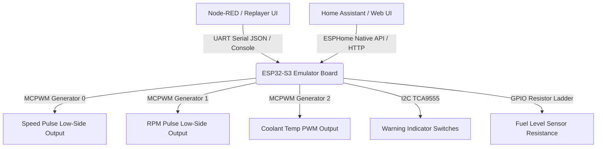

# Vehicle Emulator — Theory of Operation

## 1. Subsystem Architecture

The Emulator suite comprises firmware and orchestration layers for end-to-end bench validation:

---

## 2. Signal Simulation Mechanics

### 2.1 Hardware MCPWM Pulse Generation
- High-resolution MCPWM hardware timers generate precise frequencies without CPU jitter.
- Outputs are inverted at the ESP32-S3 GPIO Matrix (`GPIO_FUNC_OUT_INV_SEL`) to drive open-collector/low-side transistor switches.

### 2.2 19-Step Fuel Resistor Network
- Switched discrete resistor ladder replicates non-linear Opel Speedster / VX220 fuel sender curve from empty (approx 300 $\Omega$) to full (approx 40 $\Omega$).
- Synchronized stepping logic ensures glitch-free transitions during bench drivecycle playback.
