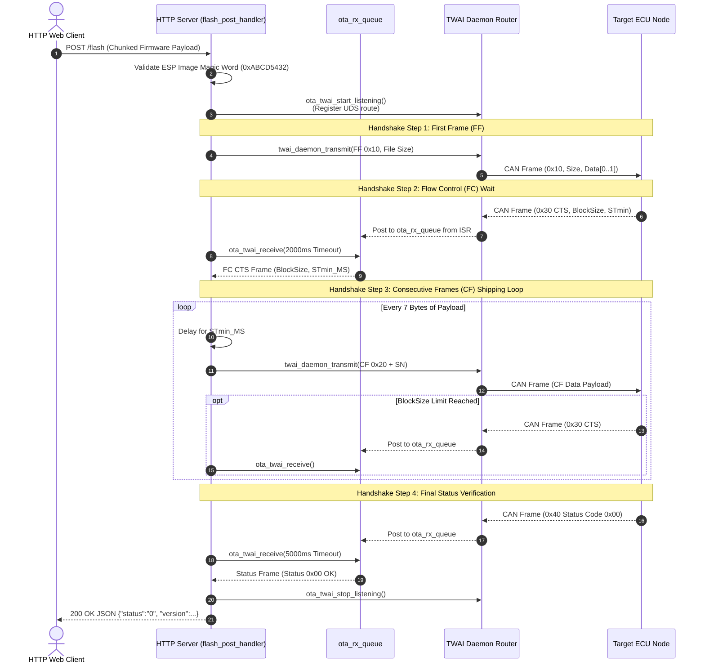
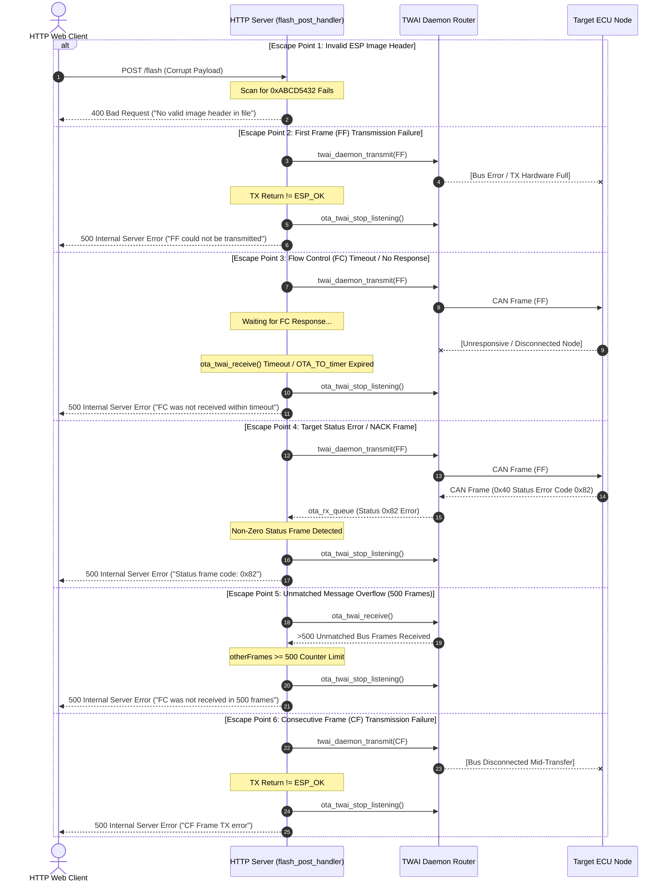

# CAN OTA Update Logic & Handshake Sequence (UDS ISO-TP)

This document details the over-the-air (OTA) logic implemented in [`main/main.cpp`](main/main.cpp) (specifically within `flash_post_handler`), which bridges HTTP firmware chunk uploads to a target CAN bus node using the UDS (Unified Diagnostic Services) protocol over ISO 15765-2 (ISO-TP).

---

## 1. Overview

The ESP32-S3 acts as an HTTP server receiving a firmware file via chunked `POST /flash` request. Instead of updating itself, it streams the firmware chunks over the CAN bus to a target node (such as a left or right cluster display).

---

## 2. TWAI Daemon Integration (`ota_twai` Helper API)

During the OTA transfer, the HTTP handler dynamically registers a route with `twai_daemon`:

1. **`ota_twai_start_listening()`**: Creates/resets `ota_rx_queue` and registers a route filter for `UDS_REQ_FRAME_ID` (`0x7E0`) via `twai_daemon_register_route`.
2. **ISR Ingestion**: The `twai_daemon` ISR (`on_rx_done`) pushes matching response frames directly to `ota_rx_queue`.
3. **Synchronous Polling**: The OTA handler polls responses via `ota_twai_receive(msg, ticks)`.
4. **`ota_twai_stop_listening()`**: Unregisters the route from `twai_daemon` upon completion or error abort, restoring standard background CAN routing.

---

## 3. ISO-TP Handshake & Transfer Protocol

```
 +------------------------------------------------------------------------------------+
 | 1. First Frame (FF) Transmitted (0x10 + Total File Size + 2 Bytes Data)            |
 +------------------------------------------------------------------------------------+
                                          |
                              [Wait for Flow Control]
                                          v
 +------------------------------------------------------------------------------------+
 | 2. Flow Control (FC) Received (0x30 CTS, BlockSize, STmin_MS)                      |
 +------------------------------------------------------------------------------------+
                                          |
                          [Ship Consecutive Frames Loop]
                                          v
 +------------------------------------------------------------------------------------+
 | 3. Consecutive Frames (CF) (0x20 + SN 1..F + Payload)                             |
 |    - Delay STmin_MS between frames                                                |
 |    - Pause & wait for FC if BlockSize limit is reached                            |
 +------------------------------------------------------------------------------------+
                                          |
                              [All Chunks Transmitted]
                                          v
 +------------------------------------------------------------------------------------+
 | 4. Final Status Frame (0x40 + OTA Status Code)                                     |
 +------------------------------------------------------------------------------------+
```

---

## 4. Sequence Diagrams & Escape Points

### 4.1 Successful UDS Handshake & Transfer Sequence



---

### 4.2 Escape Points & Error / Timeout Sequences

The OTA handler enforces explicit escape points at every step to prevent hanging or memory leaks. In all failure cases, `ota_twai_stop_listening()` is invoked to restore the `twai_daemon`.


