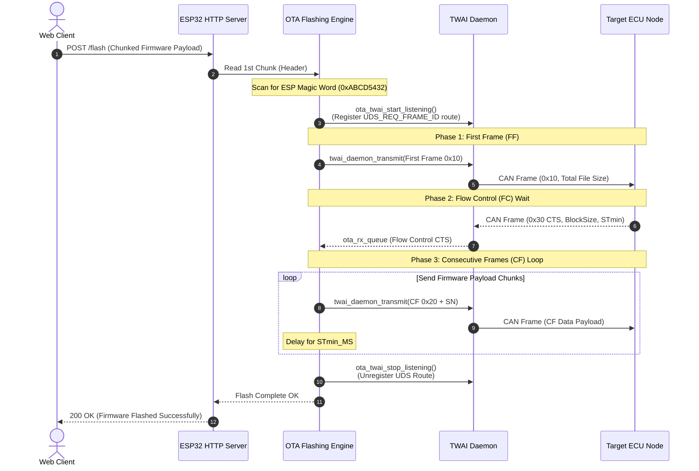
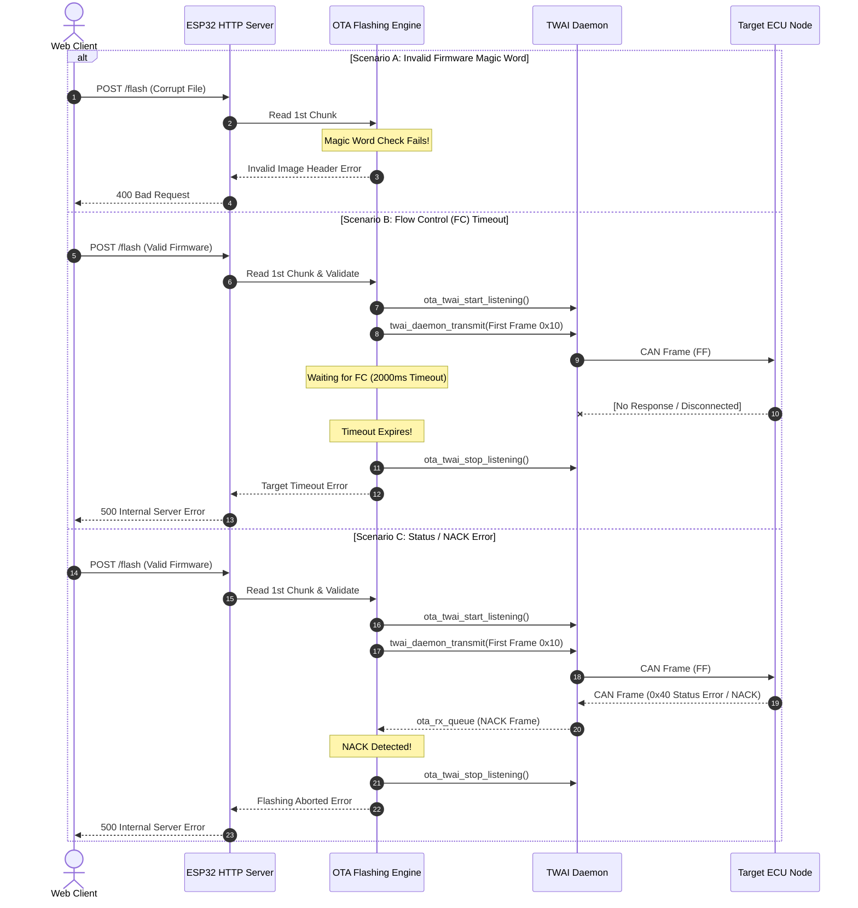

# ITF Factory App Firmware - Theory of Operation (`TOO.MD`)

The **ITF Factory App** is a diagnostic and manufacturing firmware for the ESP32-S3 Interface Board. It provides a local Wi-Fi Access Point/Station web interface to inspect board hardware status, execute self-tests, and perform Over-The-Air (OTA) firmware updates of target display clusters and interface boards via **UDS (Unified Diagnostic Services) over ISO-TP CAN bus**.

---

## 1. Subsystem Architecture

```
 +-----------------------------------------------------------------------------------+
 |                                   Client Browser                                  |
 +-----------------------------------------------------------------------------------+
                                          |
                              [HTTP / REST API / OTA POST]
                                          v
 +-----------------------------------------------------------------------------------+
 |                           ESP32-S3 HTTP Web Server                                |
 |                                                                                   |
 |  +--------------------+   +-----------------------+   +------------------------+  |
 |  |  SPIFFS Asset Host |   |   REST Diagnostic API |   |  UDS ISO-TP OTA Engine |  |
 |  +--------------------+   +-----------------------+   +------------------------+  |
 +-----------------------------------------------------------------------------------+
                                                                     |
                                                           [CAN Messages / ISO-TP]
                                                                     v
                                                         +-----------------------+
                                                         |  TWAI Daemon Router   |
                                                         +-----------------------+
                                                                     |
                                                         +-----------------------+
                                                         | Target ECU Display    |
                                                         +-----------------------+
```

### Components
1. **Wi-Fi & Network Provisioning**: Configures Wi-Fi SoftAP / Station modes and initializes mDNS (`http://itf-factory.local`).
2. **SPIFFS Static Web Hosting**: Mounts `/spiffs` storage containing HTML/JS frontend assets, serving web application requests on HTTP port 80.
3. **Diagnostic REST APIs**: Provides HTTP GET/POST endpoints for status inspection, sensor raw value reading, self-test execution, and NVS configuration.
4. **UDS ISO-TP CAN Flashing Engine**: Bridges HTTP chunked file uploads (`POST /flash`) directly to ISO 15765-2 (ISO-TP) framing over CAN bus.

---

## 2. UDS ISO-TP OTA Flashing Engine

The OTA engine (`flash_post_handler`) receives firmware binaries chunk-by-chunk via HTTP POST request and transmits them over the CAN bus to a target node.

### Route Registration Lifecycle
During OTA flashing, the handler registers a dynamic route with `twai_daemon` to receive UDS responses:
1. **`ota_twai_start_listening()`**: Creates/resets `ota_rx_queue` and calls `twai_daemon_register_route(UDS_REQ_FRAME_ID, 0xFFFFFFFF, ota_rx_queue)`.
2. **Synchronous Frame Reception**: Responses from the target node are pushed by `twai_daemon`'s ISR directly to `ota_rx_queue`. `ota_twai_receive(...)` pulls frames from this queue with a configurable timeout.
3. **`ota_twai_stop_listening()`**: Unregisters the route from `twai_daemon` upon completion or error abort.

---

## 3. Sequence Diagrams

### 3.1 Successful UDS ISO-TP Flashing Sequence



### 3.2 Error and Timeout Handling Sequence


