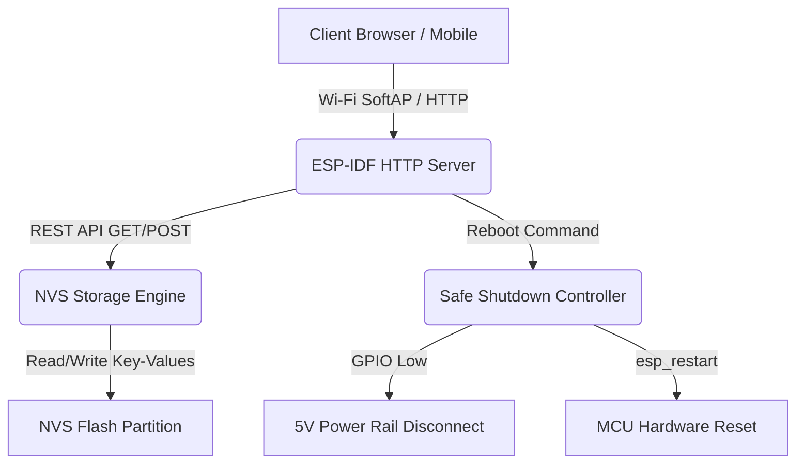

# ITF Factory App — Theory of Operation

## 1. Architecture Overview



---

## 2. NVS Calibration Schema & Provisioning Flow

### 2.1 Storage Namespace Keys (`storage`)

| NVS Key | Type | Default | Description |
| :--- | :--- | :--- | :--- |
| `fuel_learn_en` | `u8` | `1` | Enable (`1`) or disable (`0`) dynamic self-learning of full-tank resistance baseline. |
| `fuel_full_r` | `u16` | `250` | Calibrated/learned sender resistance at 100% full tank ($\Omega$). |
| `lo_fuel_thr` | `u16` | `20` | Low fuel warning threshold percentage (0–100%). |
| `overtemp_th` | `u16` | `106` | Coolant overtemperature threshold (°C). |
| `lastPart` | `i8` | `-1` | Previously active boot partition index. |

### 2.2 Odometer Namespace Keys (`nvs_odo` partition, `storage` namespace)

| NVS Key | Type | Default | Description |
| :--- | :--- | :--- | :--- |
| `odometer_m` | `u32` | `0` | Accumulated vehicle total distance in meters. |
| `trip_m` | `u32` | `0` | Accumulated trip distance in meters. |

---

## 3. REST API Endpoints

### 3.1 Calibration & Settings

- **`GET /calibration`** or **`GET /api/settings`**:
  - **Response (`application/json`)**:
    ```json
    {
      "fuel_learn_en": 1,
      "fuel_full_r": 250,
      "low_fuel_threshold": 20,
      "overtemp_threshold": 106
    }
    ```

- **`POST /set_cal`** or **`POST /api/settings`**:
  - Accepts URL query parameters or JSON body payload:
    - `new_fuel_learn_en` / `fuel_learn_en`: `0`, `1`, `true`, `false`
    - `new_fuel_full_r` / `fuel_full_r`: `150` to `350` ($\Omega$)
    - `new_low_fuel_threshold` / `low_fuel_threshold` / `lo_fuel_thr`: `0` to `100` (%)
    - `new_overtemp_threshold` / `overtemp_threshold` / `overtemp_th`: `0` to `250` (°C)
  - **Response**: HTTP 200 on successful commit, HTTP 400 on invalid or malformed parameters.

### 3.2 Odometer & Trip Management

- **`GET /odometer`**: Returns `{"odometer_m": <u32>, "trip_m": <u32>}`.
- **`POST /set_trip_odo`**: Updates `new_odo` and/or `new_trip` in `nvs_odo`.

### 3.3 NVS Dynamic Inspection & Wipe

- **`GET /nvs/list`**: Scans and enumerates all NVS partitions, namespaces, keys, and values dynamically at runtime as JSON.
- **`POST /nvs/wipe`**: Safely erases all NVS partitions (`nvs`, `nvs_odo`) and re-initializes them cleanly without forcing an immediate MCU restart.

---

## 4. Provisioning & Safety Sequencing Flow

1. **Boot Initialization**:
   - Initializes NVS (`storage` in default partition and `storage` in `nvs_odo` partition).
   - Verifies existence of required keys (`fuel_learn_en`, `fuel_full_r`, `lo_fuel_thr`, `overtemp_th`, `lastPart`, `odometer_m`, `trip_m`). Missing keys are initialized with defaults.
2. **Web Portal Interaction**:
   - Embedded static HTML/JS assets (`/spiffs/index.html`) provide controls for real-time calibration parameter adjustments.
   - Changing the `fuel_learn_en` toggle switch immediately persists the state to NVS.
   - Manual override of `fuel_full_r` allows fine-tuning or resetting to the nominal $250\,\Omega$ standard baseline.
3. **NVS Dynamic Inspection & Wipe**:
   - Web UI triggers `GET /nvs/list` to display all active NVS entries in real time.
   - `POST /nvs/wipe` allows safe recovery and defaults restoration.
4. **Safe Shutdown**:
   - `/set_boot` or `/reboot` disables 5V peripheral rails before initiating MCU reset (`esp_restart()`).
