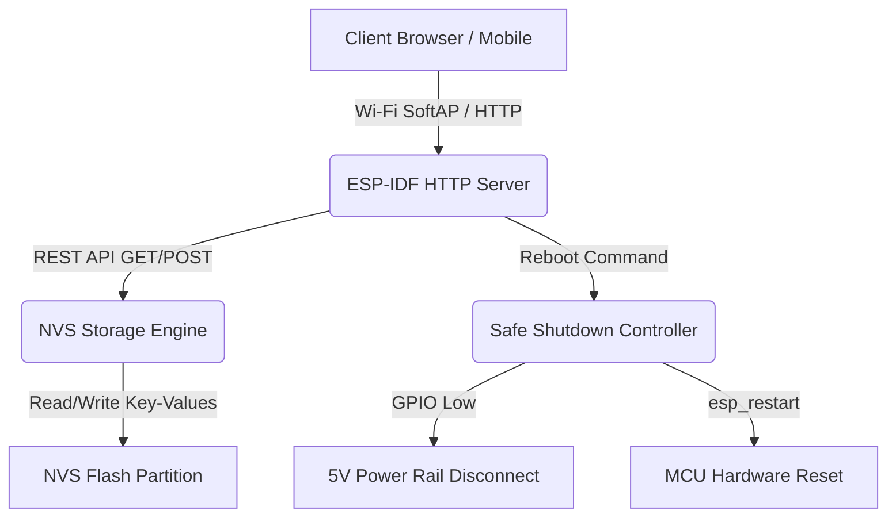

# ITF Factory App — Theory of Operation

## 1. Architecture Overview

---

## 2. NVS Calibration & Provisioning Flow

1. **Boot Check**: Upon initialization, the app verifies the existence of all critical calibration keys in NVS. If keys are missing, safe factory default values are initialized automatically.
2. **Web Interface**: The embedded static HTML/JS assets (`index.html`) provide interactive forms to adjust:
   - Speed pulses per kilometer.
   - Cylinder count and RPM multiplier.
   - Fuel tank capacity and resistance breakpoints.
   - Coolant thermistor Steinhart-Hart / beta coefficients.
3. **Validation & Persistence**: User submissions undergo client-side and server-side range validation before being committed into flash.
