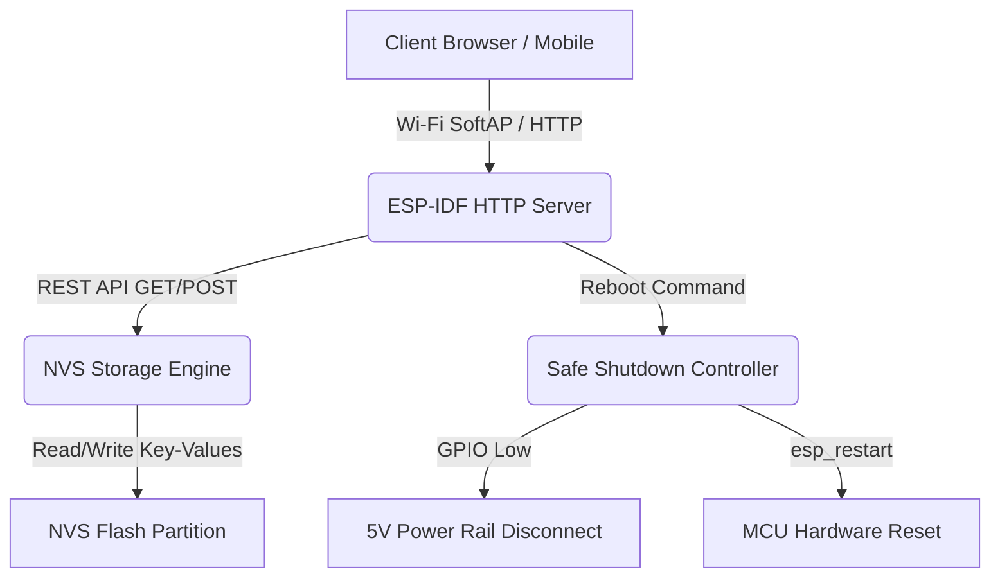

# ITF Factory App — Theory of Operation

## 1. Architecture Overview



---

## 2. NVS Calibration Schema & Provisioning Flow

### 2.1 Storage Namespace Keys (`storage`)

| NVS Key | Type | Default | Description |
| :--- | :--- | :--- | :--- |
| `fuel_learn_en` | `u8` | `1` | Enable (`1`) or disable (`0`) dynamic self-learning of full-tank resistance baseline. |
| `fuel_full_r` | `u16` | `250` | Calibrated/learned sender resistance at 100% full tank ($\Omega$). |
| `lo_fuel_thr` | `u16` | `20` | Low fuel warning threshold percentage (0–100%). |
| `overtemp_th` | `u16` | `106` | Coolant overtemperature threshold (°C). |
| `lastPart` | `i8` | `-1` | Previously active boot partition index. |

### 2.2 Odometer Namespace Keys (`nvs_odo` partition, `storage` namespace)

| NVS Key | Type | Default | Description |
| :--- | :--- | :--- | :--- |
| `odometer_m` | `u32` | `0` | Accumulated vehicle total distance in meters. |
| `trip_m` | `u32` | `0` | Accumulated trip distance in meters. |

---

## 3. REST API Endpoints

### 3.1 Calibration & Settings

- **`GET /calibration`** or **`GET /api/settings`**:
  - **Response (`application/json`)**:
    ```json
    {
      "fuel_learn_en": 1,
      "fuel_full_r": 250,
      "low_fuel_threshold": 20,
      "overtemp_threshold": 106
    }
    ```

- **`POST /set_cal`** or **`POST /api/settings`**:
  - Accepts URL query parameters or JSON body payload:
    - `new_fuel_learn_en` / `fuel_learn_en`: `0`, `1`, `true`, `false`
    - `new_fuel_full_r` / `fuel_full_r`: `150` to `350` ($\Omega$)
    - `new_low_fuel_threshold` / `low_fuel_threshold` / `lo_fuel_thr`: `0` to `100` (%)
    - `new_overtemp_threshold` / `overtemp_threshold` / `overtemp_th`: `0` to `250` (°C)
  - **Response**: HTTP 200 on successful commit, HTTP 400 on invalid or malformed parameters.

### 3.2 Odometer & Trip Management

- **`GET /odometer`**: Returns `{"odometer_m": <u32>, "trip_m": <u32>}`.
- **`POST /set_trip_odo`**: Updates `new_odo` and/or `new_trip` in `nvs_odo`.

### 3.3 NVS Dynamic Inspection & Wipe

- **`GET /nvs/list`**: Scans and enumerates all NVS partitions, namespaces, keys, and values dynamically at runtime as JSON.
- **`POST /nvs/wipe`**: Safely erases all NVS partitions (`nvs`, `nvs_odo`) and re-initializes them cleanly without forcing an immediate MCU restart.

### 3.4 WebSocket Telemetry & OTA Progress Engine (`/ws`)

- **Telemetry JSON Packet Schema** (broadcast periodically at `CONFIG_FACTORY_WS_REFRESH_RATE_HZ` default 5 Hz):
  ```json
  {
    "type": "telemetry",
    "ios": {
      "ignition": true,
      "hi_beams": false,
      "alternator": true,
      "brake_fluid": false,
      "handbrake": true,
      "oil_press": false,
      "airbag": false,
      "cel": false,
      "turn_r": false,
      "turn_l": false,
      "abs": false,
      "door": false
    },
    "adc_raw": {
      "ch0": 1250,
      "ch1": 3120,
      "ch2": 2048,
      "ch3": 4096
    },
    "mcpwm": {
      "coolant_hz": 45.2,
      "rpm_hz": 830.0,
      "speed_hz": 60.5
    },
    "can_nodes": {
      "ldb": {
        "alive": true,
        "version": "v-.-.-"
      },
      "rdb": {
        "alive": true,
        "version": "v-.-.-"
      }
    }
  }
  ```

- **OTA Progress JSON Packet Schema** (broadcast during `/upload` and `/flash` operations):
  ```json
  {
    "type": "ota_progress",
    "stage": "uploading",
    "percent": 45,
    "bytes_done": 460800,
    "total_bytes": 1024000,
    "speed_kbps": 128.5,
    "message": "Writing OTA partition..."
  }
  ```

---

## 4. UI Architecture & Navigation

The Factory App interface uses a responsive 4-tab layout built on top of [SimpleCSS](https://simplecss.org/):
1. **Setup & Calibration**: Real-time NVS calibration parameters (`fuel_learn_en`, `fuel_full_r`, `lo_fuel_thr`, `overtemp_th`) and live odometer/trip adjustment.
2. **IO & Bus Debug**:
   - **Discrete Vehicle Inputs**: 12 active-high / active-low telltale pills updated via TCA9555 expander.
   - **ADS1115 ADC Raw Volts**: 4 progress meters calibrated to 0–4096 mV (`max="4096"`), displaying un-filtered instant readings.
   - **MCPWM Capture Frequencies**: Live frequency indicators for Coolant Temp, Engine RPM, and Vehicle Speed.
   - **CAN Bus Nodes**: Status cards displaying online/offline heartbeats and parsed firmware version numbers for Left Display Board (LDB) and Right Display Board (RDB).
3. **OTA & Partitions**:
   - Active boot partition information (`ota_0`, `ota_1`, or `factory`).
   - Local firmware upload (`/upload`) and remote CAN target firmware flash (`/flash`).
   - Real-time animated progress bar with percentage, speed (kB/s), and operation status streamed over WebSocket.
4. **NVS Storage**: Live interactive table listing all active NVS partitions and keys, complete with a safe partition wipe tool (`/nvs/wipe`).

---

## 5. Provisioning & Safety Sequencing Flow

1. **Boot Initialization**:
   - Initializes NVS (`storage` in default partition and `storage` in `nvs_odo` partition).
   - Verifies existence of required keys (`fuel_learn_en`, `fuel_full_r`, `lo_fuel_thr`, `overtemp_th`, `lastPart`, `odometer_m`, `trip_m`). Missing keys are initialized with defaults.
   - Initializes I2C bus, TCA9555 IO expander, ADS1115 ADC, and MCPWM capture channels.
   - Starts TWAI CAN driver with `dispatch_can_frame` callback for LDB/RDB version and heartbeat monitoring.
   - Launches `ws_telemetry_broadcast_task` running at configured frequency (`CONFIG_FACTORY_WS_REFRESH_RATE_HZ`).
2. **Web Portal Interaction**:
   - Embedded static HTML/JS assets (`/spiffs/index.html`) provide controls for real-time calibration parameter adjustments.
   - WebSocket connection automatically establishes on page load (`ws://${window.location.host}/ws`) with auto-reconnect fallback.
3. **Safe Shutdown**:
   - `/set_boot` or `/reboot` disables 5V peripheral rails before initiating MCU reset (`esp_restart()`).

