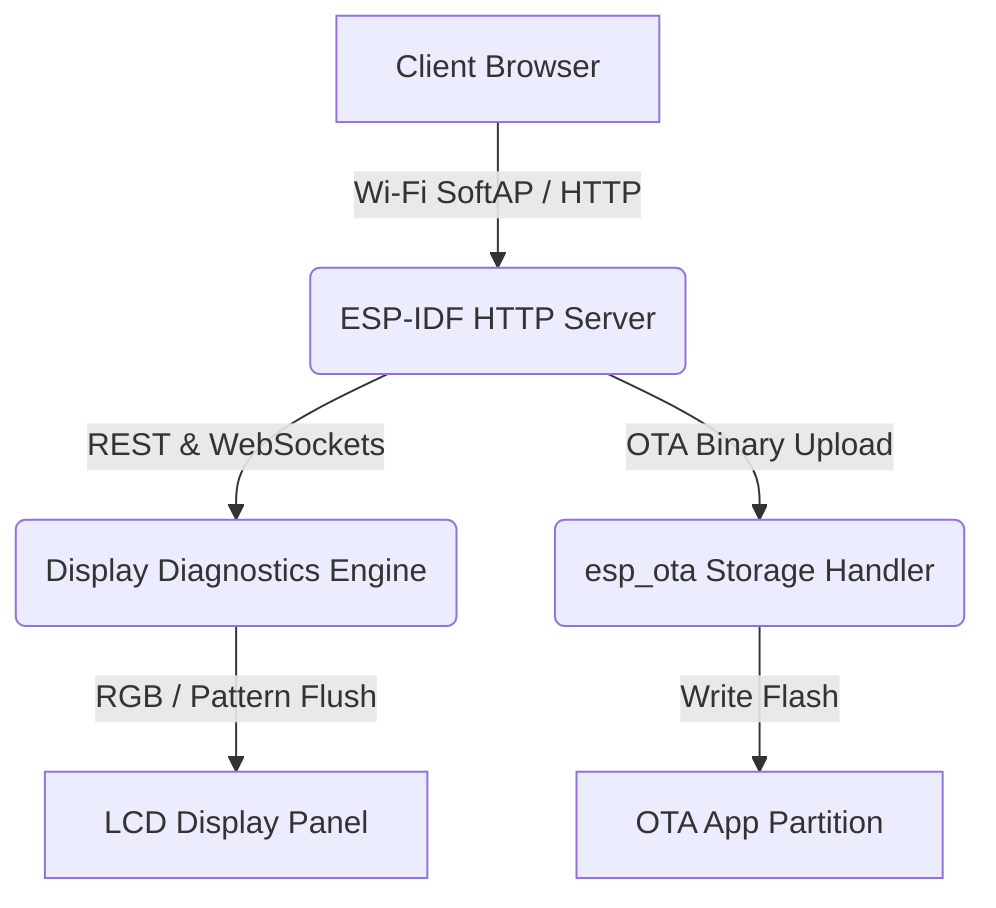

# LDB Factory App — Theory of Operation

## 1. Architecture Overview

---

## 2. Diagnostics & Test Sequencing

- **Pattern Generator**: Validates pixel response, color uniformity, and backplane contrast.
- **NVS Brightness & Offset Settings**: Calibrates minimum/maximum backlight duty cycles and display orientation parameters.
- **NVS Dynamic Inspection & Wipe**: Discovers all active NVS partitions/namespaces/keys via `GET /nvs/list` and offers full safe flash wipe via `POST /nvs/wipe`.
- **OTA Verification**: Verifies binary headers and checksums before marking OTA partitions as bootable.
