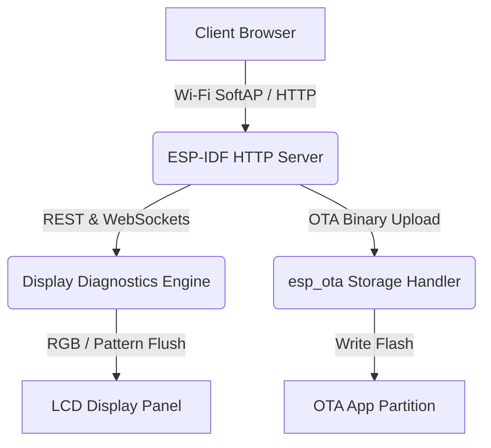

# RDB Factory App — Theory of Operation

## 1. Architecture Overview

---

## 2. Display Calibration Mechanics

- **Geometry & Alignment Grid**: Displays crosshairs and boundary rectangles to calibrate physical bezel alignment.
- **Backlight Curve Tuning**: Allows fine-tuning of PWM backlight curves stored in NVS.
- **Partition Switching**: Handles active partition verification and reboot execution.
