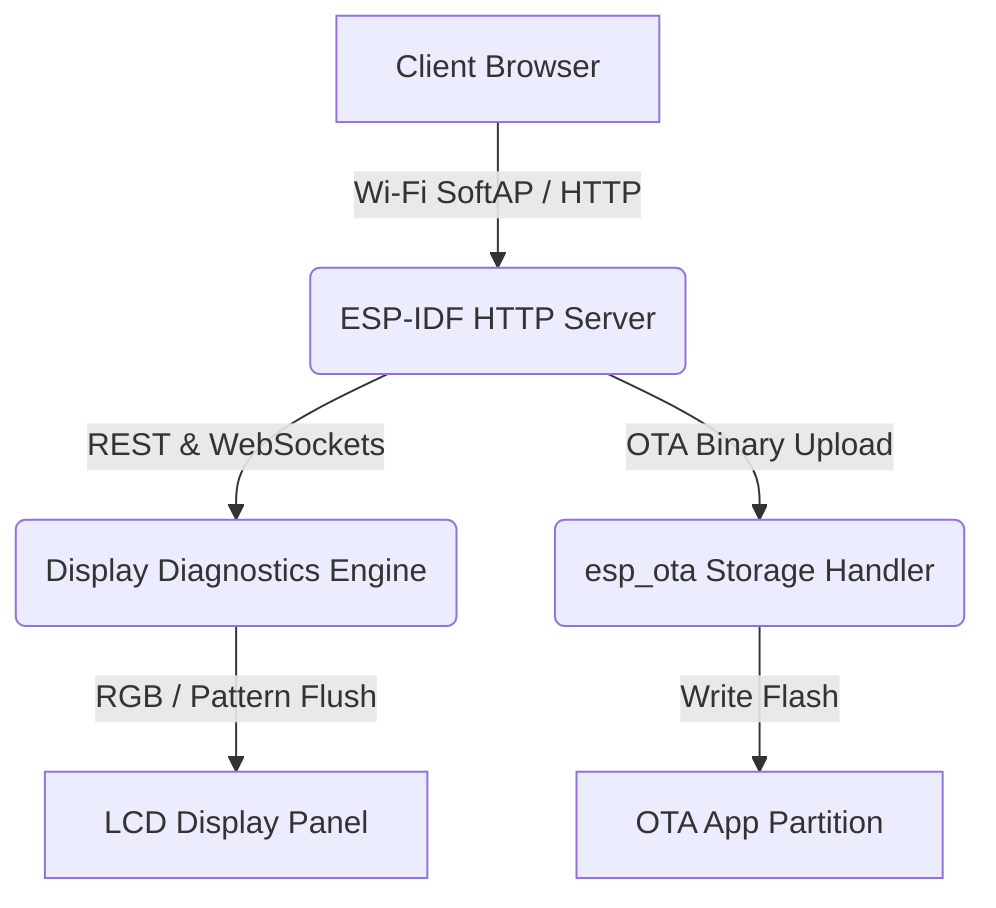

# RDB Factory App — Theory of Operation

## 1. Architecture Overview

---

## 2. Display Calibration Mechanics

- **Geometry & Alignment Grid**: Displays crosshairs and boundary rectangles to calibrate physical bezel alignment.
- **Backlight Curve Tuning**: Allows fine-tuning of PWM backlight curves stored in NVS.
- **NVS Dynamic Inspection & Wipe**: Discovers all active NVS partitions/namespaces/keys via `GET /nvs/list` and offers full safe flash wipe via `POST /nvs/wipe`.
- **TWAI / CAN Bus Protection**: Initializes `twai_daemon` with `initCAN(NULL)` on GPIO 19 (TX) and GPIO 20 (RX) upon startup, holding the transceiver TX line recessive (logic HIGH) to prevent bus grounding while in factory app mode.
- **Partition Switching**: Handles active partition verification and reboot execution.
