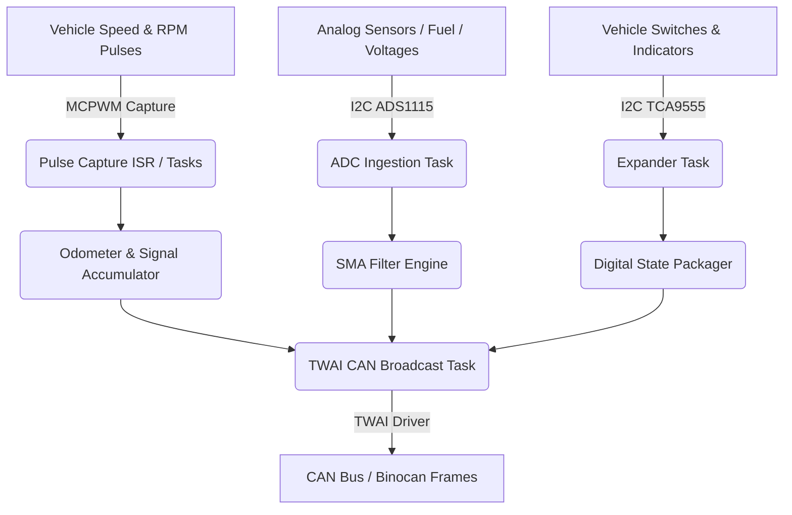

# Interface Board (ITF) — Theory of Operation

## 1. System Architecture

The Interface Board (ITF) is organized as a set of FreeRTOS tasks interacting with decoupled peripheral components:

---

## 2. Signal Processing & Ingestion

### 2.1 Speed & RPM Pulse Processing
- **Vehicle Speed**: Capture timer measures pulse period $\Delta t$. Speed in km/h is computed from pulses-per-km stored in NVS:
  $$v = \frac{3600}{\text{pulses\_per\_km} \times \Delta t}$$
- **Engine RPM**: Ignition pulse period is converted to revolutions per minute based on cylinder pulses per crankshaft revolution.
- **Pulse Accumulator**: Accumulated wheel pulses increment the high-resolution trip and odometer registers (`odometer.c`).

### 2.2 Analog Ingestion & Moving Average Filter
- ADS1115 samples analog channels continuously at configured data rates.
- The raw ADC samples are pushed into a 4-entry circular buffer.
- Simple Moving Average (SMA) filtering (`sma_filter.c`) is executed synchronously inside the CAN transmission task to prevent race conditions.

---

## 3. CAN Telemetry Dispatch

The TWAI daemon broadcasts frames according to standard schedules:
- **`ITF_values` (20 ms)**: Real-time speed, RPM, and critical drive dynamics.
- **`ITF_status` (50 ms)**: Coolant temperature, fuel level, battery voltage, and discrete indicators.
- **`ITF_debug` (100 ms)**: Raw ADC voltages, SMA debug metrics, and internal loop counters with bounded value ranges.
