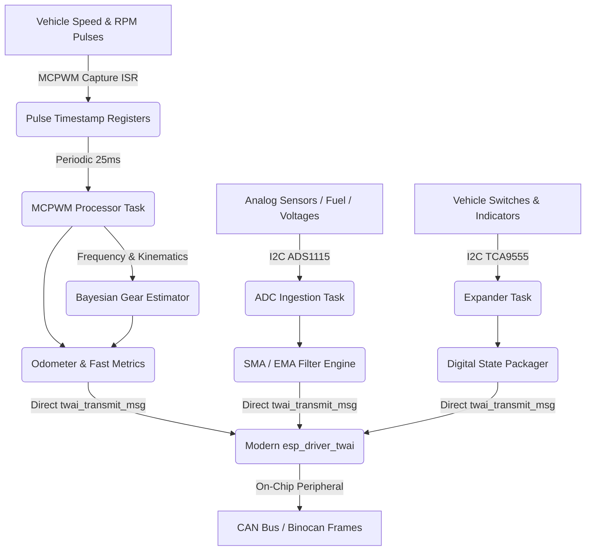
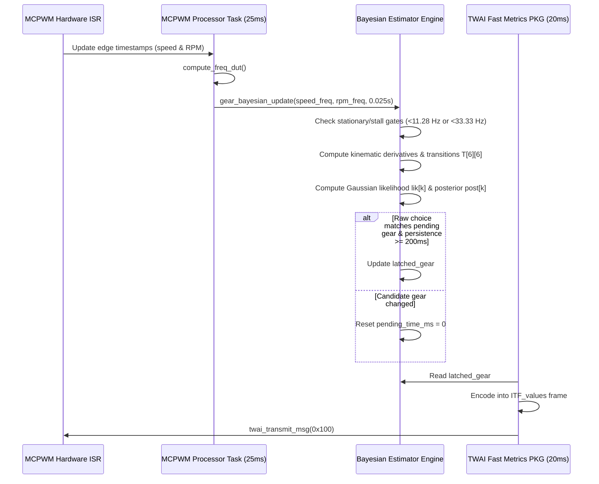

# Interface Board (ITF) — Theory of Operation

## 1. System Architecture

The Interface Board (ITF) is organized as a set of FreeRTOS tasks interacting with decoupled peripheral components:

---

## 2. Signal Processing & Ingestion

### 2.1 Speed & RPM Pulse Processing
- **Vehicle Speed**: Capture timer measures pulse period $\Delta t$. Speed in km/h is computed from pulses-per-km stored in NVS:
  $$v = \frac{3600}{\text{pulses\_per\_km} \times \Delta t}$$
- **Engine RPM**: Ignition pulse period is converted to revolutions per minute based on cylinder pulses per crankshaft revolution.
- **Pulse Accumulator**: Accumulated wheel pulses increment the high-resolution trip and odometer registers ([`odometer.c`](components/odometer/src/odometer.c)).
- **MCPWM Processor Task**: A deterministic 25 ms periodic task ([`mcpwm_processor.hpp`](main/mcpwm_processor.hpp)) computes duty cycles and frequencies for coolant, RPM, and wheel speed capture channels.

### 2.2 Analog Ingestion & Dual-Caliber Fuel Sensing
- ADS1115 samples analog channels continuously at configured data rates (Channel 0: Fuel sender, Channel 1: 12V rail, Channel 3: 3.3V reference $V_{dd}$).
- **Ratiometric Compensation**: Fuel sender resistance is computed against the live $V_{dd}$ reference reading on Channel 3 ($R_{load} = \text{COEFF\_FUEL\_CORRECTION\_MULT} \cdot K \cdot \text{raw}_{fuel} / \text{raw}_{3v3}$), with fallback to ideal 3.3V if measured $V_{ref} \notin [3.0\text{V}, 3.6\text{V}]$.
- **Dynamic Dual-Caliber Switching**:
  - Low caliber ($K_{lo} = 357.85$) switches to High caliber ($K_{hi} = 3673.88$) via GPIO 15 when $R > 300\,\Omega$.
  - High caliber switches back to Low caliber when $R < 275\,\Omega$.
  - Caliber switching evaluates instantaneous ADC counts to switch within <500 ms and synchronously re-samples and reseeds the filter.
- **Safety & Self-Learning**:
  - Open-circuit condition ($R > 3.4\text{ k}\Omega$) sets fuel level to 100% and latches the `lowFuel` telltale.
  - When `fuel_learn_en` is enabled in NVS, the board learns higher full-tank resistance values within a 10% SMA-averaged window ($\text{fuel\_full\_r} < R_{sma} \le 1.10 \times \text{fuel\_full\_r}$) and commits to NVS `fuel_full_r`.

### 2.3 Kinematic Bayesian Gear Position Estimation
The transmission gear position is estimated continuously by a kinematic-conditioned Bayesian classifier ([`gear_estimator_params.h`](main/gear_estimator_params.h)) driven by the MCPWM processing loop:

1. **Empirical Gear Ratio Model**:
   The transmission ratio $r$ is computed from instantaneous pulse frequencies:
   $$r = \frac{f_{\text{speed}}}{f_{\text{RPM}}}$$
   Each forward gear (1..5) is modeled as a normal distribution $\mathcal{N}(\mu_k, \sigma_k^2)$ using calibrated means and variances:
   - 1st Gear: $\mu_1 = 1.0180$, $\sigma_1^2 = 0.01701$
   - 2nd Gear: $\mu_2 = 1.7930$, $\sigma_2^2 = 0.01077$
   - 3rd Gear: $\mu_3 = 2.7260$, $\sigma_3^2 = 0.00584$
   - 4th Gear: $\mu_4 = 3.7630$, $\sigma_4^2 = 0.00206$
   - 5th Gear: $\mu_5 = 4.5420$, $\sigma_5^2 = 0.00193$

2. **Kinematic State Transition Matrix**:
   A 6-state transition matrix $T[6][6]$ ($S_0 = \text{Neutral}, S_1..S_5 = \text{Gears } 1..5$) adapts based on vehicle speed derivative $\frac{\Delta f_{\text{speed}}}{\Delta t}$ and engine RPM:
   - When accelerating ($\frac{\Delta f_{\text{speed}}}{\Delta t} \ge 0$) at elevated engine speed ($f_{\text{RPM}} \ge 55\text{ Hz}$), upshift probability $T[k][k+1]$ increases to $0.06$.
   - When decelerating ($\frac{\Delta f_{\text{speed}}}{\Delta t} < -3.0\text{ Hz/s}$), downshift probability $T[k][k-1]$ increases to $0.06$.

3. **Clutch Drop & Suppression**:
   Sudden engine deceleration during shifts ($\frac{\Delta f_{\text{RPM}}}{\Delta t} < -35\text{ Hz/s}$) with sustained vehicle speed detects clutch disengagement. The estimator suppresses phantom upshift hypotheses to higher gears while the engine falls toward idle.

4. **Debounce Persistence**:
   A candidate gear state must remain stable for $\ge 200\text{ ms}$ before updating `latched_gear`. When speed or RPM falls below operating thresholds ($f_{\text{speed}} < 11.28\text{ Hz}$ or $f_{\text{RPM}} < 33.33\text{ Hz}$), the estimator reverts to `GEAR_NEUTRAL` ($0$).

---

## 3. CAN Telemetry Dispatch

The TWAI daemon broadcasts frames via zero-copy direct transmission according to standard schedules:
- **`ITF_values` (20 ms)**: Real-time speed, RPM, and latched gear position (`itf_gear_position_st`).
- **`ITF_status` (50 ms)**: Coolant temperature, fuel level, battery voltage, and discrete indicators.
- **`ITF_odometer` (250 ms)**: Monotonic odometer and trip distance.
- **`ITF_board_version` (1000 ms)**: App descriptor metadata and git commit SHA.
- **`ITF_debug` (100 ms)**: Debug telemetry broadcast tasks (enabled conditionally via Kconfig):
  - `DBG_ITF_speed` (`0x300`): Raw speed frequency and duty cycle.
  - `DBG_ITF_RPM` (`0x301`): Raw RPM frequency and duty cycle.
  - `DBG_ITF_coolant` (`0x302`): Coolant sensor PWM frequency and duty cycle.
  - `DBG_ITF_ADC_raw` (`0x303`): Unfiltered supply rail voltages (3.3V $V_{dd}$ reference and 12V board rail).
  - `DBG_ITF_pulse_counts` (`0x304`): Cumulative monotonic pulse counts for RPM and vehicle speed signals.
  - `DBG_ITF_fuel` (`0x305`): Raw fuel sender voltage, unfiltered fuel percentage, active/learned $R_{full}$ baseline, and dynamic sender resistance ($\Omega$).
