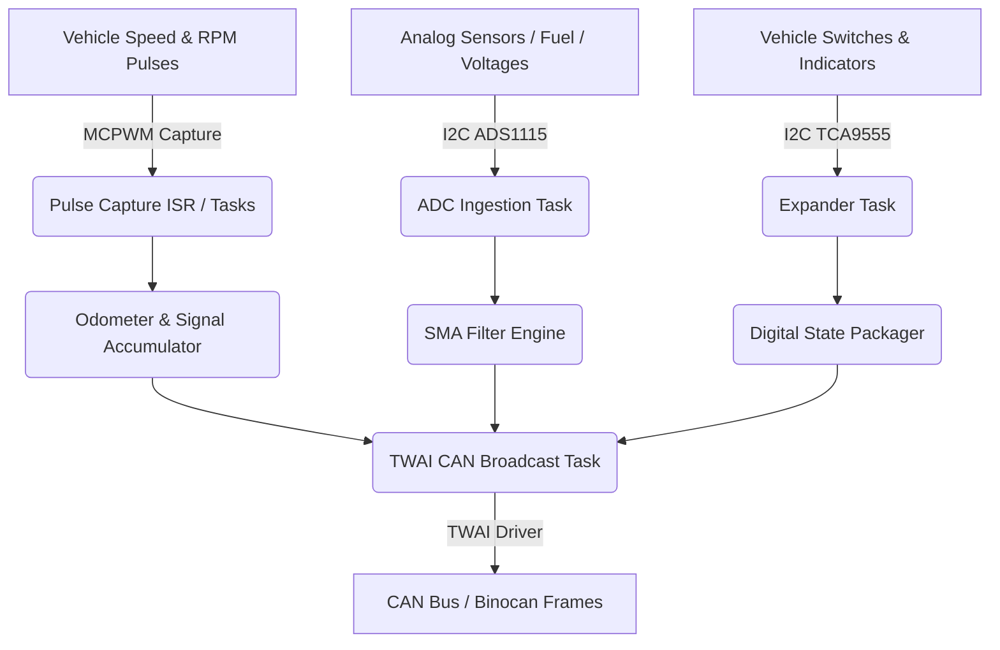

# Interface Board (ITF) — Theory of Operation

## 1. System Architecture

The Interface Board (ITF) is organized as a set of FreeRTOS tasks interacting with decoupled peripheral components:

---

## 2. Signal Processing & Ingestion

### 2.1 Speed & RPM Pulse Processing
- **Vehicle Speed**: Capture timer measures pulse period $\Delta t$. Speed in km/h is computed from pulses-per-km stored in NVS:
  $$v = \frac{3600}{\text{pulses\_per\_km} \times \Delta t}$$
- **Engine RPM**: Ignition pulse period is converted to revolutions per minute based on cylinder pulses per crankshaft revolution.
- **Pulse Accumulator**: Accumulated wheel pulses increment the high-resolution trip and odometer registers (`odometer.c`).

### 2.2 Analog Ingestion & Dual-Caliber Fuel Sensing
- ADS1115 samples analog channels continuously at configured data rates (Channel 0: Fuel sender, Channel 1: 12V rail, Channel 3: 3.3V reference $V_{dd}$).
- **Ratiometric Compensation**: Fuel sender resistance is computed against the live $V_{dd}$ reference reading on Channel 3 ($R_{load} = K \cdot \text{raw}_{fuel} / \text{raw}_{3v3}$), with fallback to ideal 3.3V if measured $V_{ref} \notin [3.0\text{V}, 3.6\text{V}]$.
- **Dynamic Dual-Caliber Switching**:
  - Low caliber ($K_{lo} = 357.85$) switches to High caliber ($K_{hi} = 3673.88$) via GPIO 15 when $R > 325\,\Omega$.
  - High caliber switches back to Low caliber when $R < 300\,\Omega$.
  - Caliber switching synchronously re-samples and reseeds the Simple Moving Average (SMA) filter.
- **Safety & Self-Learning**:
  - Open-circuit condition ($R > 3.4\text{ k}\Omega$) sets fuel level to 100% and latches the `lowFuel` telltale.
  - When `fuel_learn_en` is enabled in NVS, the board learns higher full-tank resistance values within a 10% SMA-averaged window ($\text{fuel\_full\_r} < R_{sma} \le 1.10 \times \text{fuel\_full\_r}$) and commits to NVS `fuel_full_r`.

---

## 3. CAN Telemetry Dispatch

The TWAI daemon broadcasts frames according to standard schedules:
- **`ITF_values` (20 ms)**: Real-time speed, RPM, and critical drive dynamics.
- **`ITF_status` (50 ms)**: Coolant temperature, fuel level, battery voltage, and discrete indicators.
- **`ITF_debug` (100 ms)**: Debug telemetry broadcast tasks (enabled conditionally via Kconfig):
  - `DBG_ITF_speed` (`0x300`): Raw speed frequency and duty cycle.
  - `DBG_ITF_RPM` (`0x301`): Raw RPM frequency and duty cycle.
  - `DBG_ITF_coolant` (`0x302`): Coolant sensor PWM frequency and duty cycle.
  - `DBG_ITF_ADC_raw` (`0x303`): Unfiltered ADC voltages for fuel sender and 12V rail.
  - `DBG_ITF_pulse_counts` (`0x304`): Cumulative monotonic pulse counts for RPM and vehicle speed signals.
