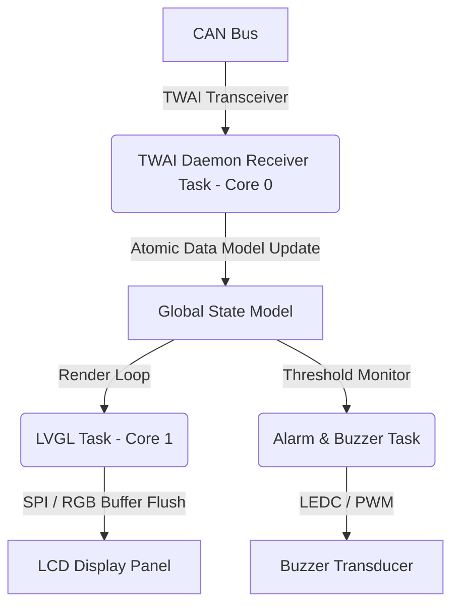

# Left Display Board (LDB) — Theory of Operation

## 1. Architecture Overview

The Left Display Board executes a multi-task FreeRTOS architecture:

---

## 2. UI Pipeline & Font Rendering

- **LVGL v9 Port**: Custom double-buffered rendering pipeline with DMA transfers (`lvgl_v9_port.cpp`).
- **Typography**: Custom-generated White Rabbit pixel fonts (20px, 28px, 32px) for crisp contrast under automotive lighting.
- **Startup Animation**: Ignition-on sequence sweeps the RPM arc to max scale and back, illuminates all warning telltales, and transitions into live mode (`start_animation.hpp`).

---

## 3. Telemetry & Fault Alerts

- **CAN Ingestion**: Ingests vehicle speed, engine RPM, odometer pulses, and coolant temperature.
- **Overtemperature Alarm**: When coolant temperature exceeds the calibrated threshold (default 105°C), the alarm monitor triggers visual flashing on the UI and pulsates the audible buzzer until temperature drops below hysteresis limit (98°C).
