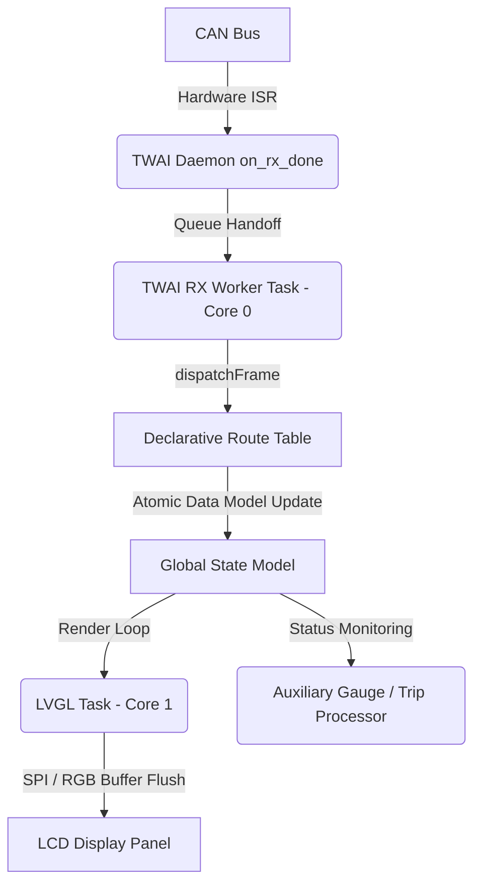

# Right Display Board (RDB) — Theory of Operation

## 1. Architecture Overview

The Right Display Board executes a multi-task FreeRTOS architecture:

---

## 2. UI Pipeline & Font Rendering

- **LVGL v9 Port**: Custom double-buffered rendering pipeline with DMA transfers (`lvgl_v9_port.cpp`).
- **Typography**: Custom-generated White Rabbit pixel fonts (20px, 28px, 32px) for crisp contrast under automotive lighting.
- **Boot Sequence**: Initializes secondary instrumentation, oil pressure, charge cooling metrics, and trip statistics.

---

## 3. CAN Telemetry & Declarative Route Dispatch

- **Declarative Routing Table**: Frame ingestion is orchestrated by `rx_routes[]` in `twai_ops.hpp`, associating Frame IDs (`BINOCAN_ITF_ACTIVE_HI_LO_FRAME_ID`, `BINOCAN_ITF_SLOW_METRICS_FRAME_ID`, `BINOCAN_EXT_OIL_METRICS_FRAME_ID`, etc.) with unpack handlers and watchdog timers.
- **Watchdog Lifecycles**: Incoming frames automatically reset per-signal FreeRTOS software timers. If signal loss occurs (> 5 cycles), callbacks revert cluster variables to safe default failure values.
