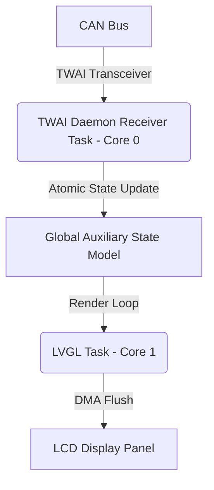

# Right Display Board (RDB) — Theory of Operation

## 1. Architecture Overview

The Right Display Board architecture coordinates telemetry ingestion, state aggregation, and LVGL graphics rendering:

---

## 2. Ingestion & Multi-Screen Views

- **Auxiliary Gauges**: Renders fuel quantity (liters / bar graph), low-voltage battery status, and oil pressure.
- **Trip Statistics**: Displays trip distance, average speed, runtime elapsed, and maximum velocity.
- **Diagnostics**: Presents active diagnostic codes and CAN bus communication health metrics.
